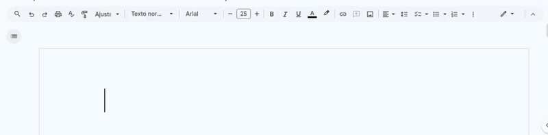

# ia26-webdesign

Essa disciplina tem o objetivo de ensinar como criar sites e páginas na internet.

Ela foca em 3 tecnologias principais:

- **HTML** → responsável pela estrutura do site (o conteúdo)
- **CSS** → responsável pela aparência (cores, [layout](https://pt.wikipedia.org/wiki/Layout_gr%C3%A1fico), [design](https://pt.wikipedia.org/wiki/Design))
- **JavaScript** → responsável pelo comportamento (interações e funcionalidades)


## Antes de começar

É Interessante que tenhamos um ambiente de desenvolvimento configurado nas nossas máquinas, nesse caso precisamos de um editor de código e um navegador da web. Vamos estar utilizando o Visual Studio Code como editor de ćodigo (Já que é de graça e muito utilizado) e para navegador da web vamos utilizar o Google Chrome como navegador (pelo mesmo motivo).

## HTML - O que é? Para que serve?

HTML é a abreviação de "HyperText Markup Language" que traduzindo para o português fica Linguagem de Marcação de Hipertexto, como o nome sugere, ela é uma linguagem de marcação (não de programação) ela é usada para estruturar o conteúdo da página web, pela descrição até parece que é algo visual né? Mas não, o HTML é responsável por organizar o conteúdo, ou seja ela é tipo o esqueleto, fazendo assim com que seja possível qualquer tipo de usuário utilizar o site, incluindo aqueles com deficiência. Logo chegamos a conclusão de que o HTML é importante para a **acessibilidade** e **usabilidade** do site.

##  Elementos do HTML

### O que são os elementos do HTML?

Os elementos do HTML são as partes que formam uma página web. Cada elemento é representado por uma **tag**, que indica ao navegador como o conteúdo deve ser exibido.

#### Exemplos:
- `<h1>` → define um título  
- `<p>` → define um parágrafo  
- `<a>` → define um link  

Esses elementos ajudam a **organizar e estruturar** o conteúdo da página.

---

###  Entendendo na prática

Pense em um editor como **[Word](https://pt.wikipedia.org/wiki/Microsoft_Word)** ou **[Google Docs](https://www.about.google/docs/about/?hl=pt-BR)**.

Neles, você:
- seleciona um texto  
- aplica formatação (negrito, itálico, etc.)

No HTML, você faz isso usando **tags**.

---

###  Como funcionam as tags?

As tags geralmente têm **abertura e fechamento**:

```html
<p>Este é um parágrafo</p>
```
- `<p>` → abre a tag
- `</p>` → fecha a tag
- O conteúdo fica entre elas

## Agora vamos ver, na prática, como transformamos uma ideia de formatação em código HTML:



---

Na animação, o usuário digita no editor a frase `lorem ipsum dolor sit amet potentia` e, em seguida, aplica algumas formatações. Abaixo está o equivalente em HTML de cada ação:

1. O usuário seleciona `lorem ipsum` e aplica negrito.

   * Em HTML, isso fica:
```html
     <strong>lorem ipsum</strong> dolor sit amet potentia
```
A tag `<strong>` indica que o texto entre `<strong>` e `</strong>` deve aparecer em negrito.

2. O usuário seleciona `sit amet` e aplica itálico.

   * Em HTML, isso fica:
```html
     <strong>lorem ipsum</strong> dolor <em>sit amet</em> potentia
```    
A tag `<em>` indica que o texto entre `<em>` e `</em>` deve aparecer em itálico.

3. O usuário seleciona `ipsum dolor sit` e aplica a cor vermelha.

   * Em HTML, isso fica:
```html
     <strong>lorem <span style="color: red;">ipsum dolor sit</span></strong> amet <em>sit amet</em> potentia
```
 A tag `<span>` é usada para aplicar estilos específicos, e o atributo `style="color: red;"` define a cor vermelha para o trecho selecionado.

---


> ## ⚠️ Nota:
> ### O HTML é uma linguagem de marcação, e seu principal objetivo é estruturar o conteúdo de uma página web. Caso pesquise na internet, notará que existem outras tags para aplicar formatações como negrito e itálico, como `<b>` e `<i>`, respectivamente. No entanto, as tags `<strong>` e `<em>` são consideradas mais semânticas, pois indicam a importância do texto, enquanto as tags `<b>` e `<i>` são puramente de formatação visual. Portanto, é recomendado usar as tags semânticas para melhorar a acessibilidade e a compreensão do conteúdo. `<strong>` e `<em>` fazem sentido tanto para leitores sem deficiência quanto para leitores com deficiência, pois indicam a importância do texto, enquanto `<b>` e `<i>` são puramente de formatação visual e podem não ser interpretados corretamente por leitores de tela ou outros dispositivos assistivos.

HTML tem uma estrutura básica, mas existem muitas outras tags que ajudam a criar sites mais completos e interativos.

Uma boa forma de aprender é desenhar no papel como você quer que a página fique e pensar qual tag usar em cada parte. Depois, é só passar isso para o código.

O mais importante é praticar: criar páginas diferentes e testar novas tags.

No final, você vai fazer um exercício criando uma página simples para treinar e entender melhor como usar as tags corretamente.

## Estrutura básica de um documento HTML

---

Todo arquivo HTML começa com a declaração `<!DOCTYPE html>`, que informa ao navegador que o documento segue o padrão do HTML5.

Depois disso, o código é dividido em duas partes principais: `<head>` e `<body>`.

* O `<head>` contém informações sobre a página, como título, configurações, links de CSS, scripts e meta tags. Essas informações não aparecem diretamente para o usuário, mas são essenciais para o funcionamento do site.

* O `<body>` é onde fica todo o conteúdo visível da página, como textos, imagens, links e títulos. É a parte que o usuário realmente vê ao acessar o site.

Resumindo: o `<head>` configura a página e o `<body>` mostra o conteúdo.

---

### Exemplo de estrutura básica de um documento HTML:

```html
<!DOCTYPE html>
<html lang="pt-BR">
<head>
   <meta charset="UTF-8">
   <title>Título da Página</title>
   <!-- Links para arquivos CSS e scripts JavaScript podem ser adicionados aqui -->
</head>
<body>
   <!-- Conteúdo visível da página é adicionado aqui -->
</body>
</html>
```

---


> ## **⚠️ Nota:**
>
> ### Todo o código HTML deve ser escrito dentro da tag `<html>`, que é a raiz do documento (ou seja, tudo começa nela).
>
> ### O atributo `lang="pt-BR"` indica que o idioma principal da página é o português do Brasil. Isso é importante para acessibilidade e também para mecanismos de busca entenderem melhor o conteúdo.
>
> ### A tag `<meta charset="UTF-8">` define a codificação de caracteres, garantindo que acentos e símbolos especiais apareçam corretamente na página.
>
> ### Já a tag `<title>` define o título da página, que aparece na aba do navegador e também nos resultados de busca.


Aqui vai reescrito **no mesmo estilo que você usou acima** (didático, explicando como se estivesse falando com o aluno, simples e direto 👇):

---

### Atributos HTML

Os atributos HTML são usados para dar **informações extras** para os elementos.

Eles ficam dentro da **tag de abertura** e são escritos como:

* um **nome**
* um **valor**
* separados por um sinal de igual `=`

Esses atributos servem para definir características do elemento, como aparência, comportamento ou funcionalidade.

Por exemplo:

* o atributo `href` na tag `<a>` define para onde o link vai
* o atributo `src` na tag `` define qual imagem será exibida

---

### Entendendo na prática

Imagine que queremos criar um link para o Google.

Para isso, usamos a tag `<a>` junto com o atributo `href`, que indica o destino do link:

```html
<a href="https://www.google.com">Visite o Google</a>
```

Nesse caso:

* `<a>` → define o link
* `href="https://www.google.com"` → define o destino
* `Visite o Google` → é o texto clicável

Quando o usuário clicar nesse link, ele será levado para o site do Google.

---

### Links úteis

Se quiser ver todas as tags HTML disponíveis, você pode acessar:

* MDN Web Docs (documentação oficial)
* W3Schools (mais simples e direto)

---

## CSS - O que é? Para que serve?

O CSS (Cascading Style Sheets) é a linguagem usada para definir a **aparência** de uma página web.

Enquanto o HTML organiza o conteúdo, o CSS cuida de coisas como:

* cores
* fontes
* espaçamento
* layout

Ou seja, o HTML é o **esqueleto** e o CSS é a **aparência**.

---

### Como o CSS funciona?

O CSS funciona através de **regras de estilo**.

Cada regra tem:

* um **seletor** → escolhe o elemento
* um **bloco de declarações** → define o estilo

---

### Exemplo na prática

Considere esse HTML:

```html
<h1>Olá, Mundo!</h1>
<p>Este é um exemplo de CSS.</p>
```

Agora um CSS simples:

```css
h1 {
  color: #333333;
  text-align: center;
}

p {
  color: #666666;
  font-size: 18px;
}
```

Nesse caso:

* o `<h1>` fica centralizado e com cor escura
* o `<p>` fica com cor mais clara e tamanho maior

---

> ## ⚠️ Nota:
>
> O CSS normalmente fica em um arquivo separado (ex: `styles.css`) e é conectado ao HTML usando a tag `<link>`. Isso ajuda a manter o código organizado.

---

### Sem CSS

Sem o CSS, o site usa o estilo padrão do navegador.

Isso é chamado de **user agent stylesheet**, que nada mais é do que o estilo básico aplicado automaticamente.

Ou seja:

* sem CSS → página simples e sem design
* com CSS → página personalizada e mais bonita

---

## Sintaxe do CSS

A estrutura básica do CSS é:

```css
seletor {
  propriedade: valor;
}
```

Exemplo:

```css
p {
  color: red;
}
```

---

> ## ⚠️ Nota:
>
> * o seletor define *quem será estilizado*
> * a propriedade define *o que será alterado*
> * o valor define *como será alterado*
> * cada linha termina com `;`

---

## Seletores CSS

Os seletores servem para escolher quais elementos do HTML vão receber estilo.

---

### Tipos mais comuns

1. **Seletor de tipo**

   * seleciona elementos pelo nome

   ```css
   p { color: blue; }
   ```

2. **Seletor de classe**

   * seleciona por classe

   ```css
   .titulo { font-size: 24px; }
   ```

3. **Seletor de ID**

   * seleciona por ID

   ```css
   #paragrafo1 { color: red; }
   ```

4. **Seletor de atributo**

   ```css
   a[href="#"] { text-decoration: none; }
   ```

5. **Pseudo-classes**

   ```css
   p:first-child { font-weight: bold; }
   ```

---

### Hierarquia (muito importante)

O CSS segue a estrutura do HTML.

Exemplo:

```html
<main>
  <section>
    <p>Texto aqui</p>
  </section>
</main>
```

Se usarmos:

```css
main section p {
  color: green;
}
```

Isso significa:

* selecione `<p>`
* que está dentro de `<section>`
* que está dentro de `<main>`

---

> ## ⚠️ Nota:
>
> O espaço entre os seletores indica que um elemento está **dentro do outro** (relação de descendente).

---

### Tipos de relações

* `elemento1 elemento2` → descendente
* `elemento1 > elemento2` → filho direto
* `elemento1 + elemento2` → irmão imediato
* `elemento1 ~ elemento2` → irmãos em geral

---

## Praticando

A melhor forma de aprender HTML e CSS é praticando:

* criar páginas simples
* testar estilos diferentes
* modificar códigos e ver o resultado

## Praticando o uso de HTML e CSS ...
[isso é tema para a próxima aula] ... see you space cowboy! 
